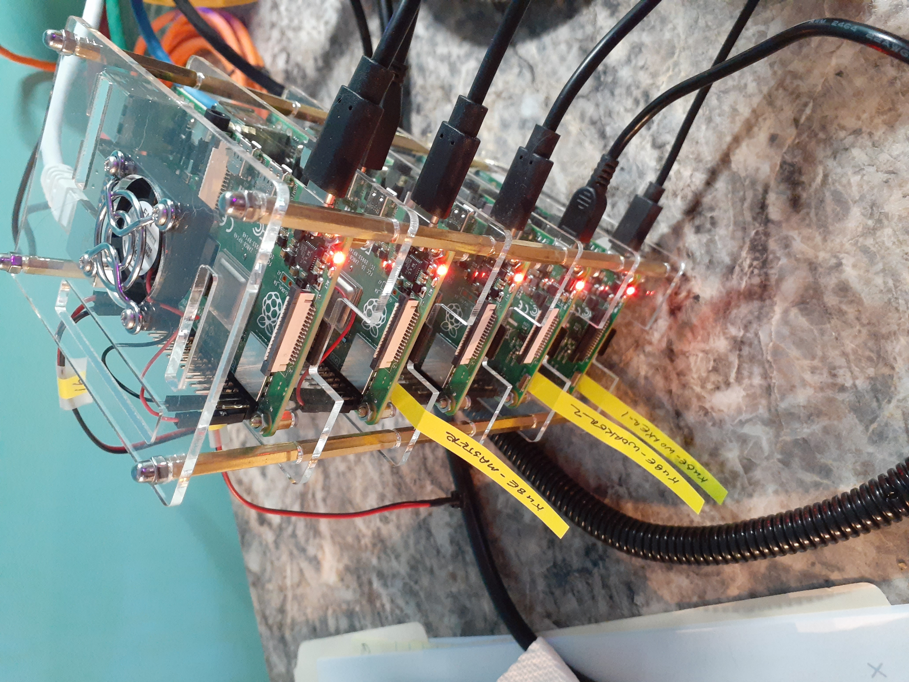
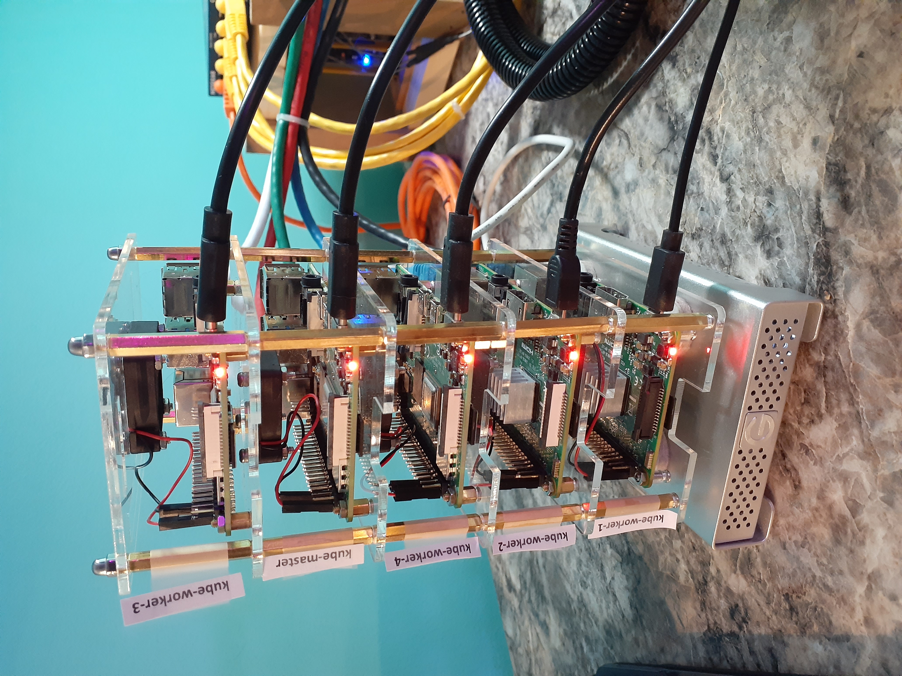

= Infrastructure Journal
FortyTwoBinary Team
:description: Infrastructure Change Journal
:toc: left
:icons: font
:imagesdir: images/
:docinfo: shared
:numbered:
:source-highlighter: coderay
:stylesheet: italian-pop.css
:website: https://fortytwobinary.com/
:author: David L. Whitehurst

{{website}[Site Homepage]

{endpoint-url}/welcome.html[Lab Homepage]

image:vy.png["Company Logo",height=32]

Welcome to the FortyTwoBinary service journal of infrastructure changes
on multiple platforms across our home network. This document is subject
to great change and will be maintained in a software repository
https://github.com/fortytwobinary/labdocs[here].

.This document
**********************************************************************
This document was written using asciidoc markup and the HTML you see is
generated by a tool driven using Python called asciidoctor. This
{description} is a powerful document that can be of great value in the
event of data loss, machine crashes, backups, maintenance, installations,
and troubleshooting.
**********************************************************************

== Introduction
This document contains my writings on the build-out of a network fortytwobinary.lab
and the infrastructure to support a Kubernetes environment using 3 Raspberry
Pi small board computers (SBC) to start.

The network will host a Gitlab instance as a central repository for source, configuration,
documentation, and reference.

The fortytwobinary.lab network is strictly for experimentation and education.

== Apr 2021
I've decided to add entries for each month over the previous month however, specific entries for
the month will be in reverse (newest first) order.

=== Apr 20, 2021
I've recently moved the Wiki.js database under K8s management. And, I've also hosted an instance of
Wordpress and it's database on K8s too. I wrote backups for the `tools` repo but while the shell scripts
run from kube-master manually, they only simulate success in Jenkins jobs. The backup jobs in Jenkins use SSH
kube-master (192.168.1.12) but the complex context switching is logging errors as if the script does run
as ubuntu on the right machine but files needed in the script are not available on that host. The backup
process begins with a simple `mysqldump` however the entire process is quite complex due to the single
database pod. In a true production situation, the database would be hosted differently and I would have an
entirely new set of problems.

Please note that both Wordpress and Wiki.js backups are failing even though Jenkins is reporting success and
also sending this success to Slack.

=== Apr 21, 2021
I realized tonight that only one of the backups on Jenkins was actually broken. The wordpress shell script needed the entire path to the two files that were being copied to the Kubernetes pod. Both wordpress and wikijs backups did need the tty option removed from the `kubectl exec` commands. These things were fixed and the scripts pushed to Github. Also, the backups were set to run at 8:35 and 8:40PM (0:35 and 0:40 UTC).

=== Apr 22, 2021
I built an arm64 docker image of Nexus3 and was successful deploying it to my Kubernetes. I was able to visit https://nexus.fortytwobinary.com and login as admin. I was not however, able to docker login to the docker registry private on port 5000 using internal IP or external DNS. I plan to revise the service and ingress. I'll try the docker login again sometime tonight.

=== Apr 23, 2021
Last night I fixed Nexus3 to serve two endpoints, https://nexus.fortytwobinary.com and https://docker.fortytwobinary.com. The nexus endpoint provides access using basic authentication into a web portal of Nexus3 overall. The docker endpoint provides access into a Docker registry, ssl-terminated, but ultimately HTTP into a docker service on a container's port 5000 (docker-only). I was able to create a Docker registry in Nexus and also login to the new Docker registry via command-line. I pushed two images, one for Jenkins (arm64) and one for Nexus3 (arm64). This was a huge success.

The issues that remain for me are:

1. /mnt/ext/nexus3 remains file permissions 777
2. Could not host service using YAML. This was accomplished with `kubectl expose`.

=== Apr 24, 2021
Last night I worked on shell scripts and command-line tools. I cleaned
up my repositories. This morning I just renamed the site Jenkins build to
labddocs-deploy and added an Embedded Build plugin so that any Jenkins
git build status can be added to READMEs.

Today, I am installing Prometheus on my cluster
and lens on my macbook pro. Lens is available here https://k8slens.dev/ and I'll discuss the Prometheus install a little later.

== Mar 2021
I'll start my journal here with a picture of the devices currently on the
FortyTwoBinary home (internal) network. Here's a snip from the router admin
showing the wired and wireless devices currently enabled. I'll dive into more
detail below.

image:mar-13-2021-attached.PNG["Network attached"]

The two wired machines prefixed with `kube-` are the two machines at the bottom
of my Raspberry Pi tower. These two machines are Pi 3 Model Bs. They are currently
running Raspbian-lite (buster 10) on 16GB micro SD cards. The machines above them
are newer Pi 4 Model B devices.

image:tower.jpg["Tower"]

Yes, it's a mess but, it's a start. Currently, the middle, 192.168.1.7
or third from the bottom is the first 4B I've purchased. It's currently hosting
Gitlab on port 80 and these pages on 8081. This journal page is hosted by an
Apache2 docker image on that middle machine. The machine is currently named
angry-apache and is connected to the network via wireless adapter.

The very top machine, 192.168.1.16 hosts a Bind9 service for the fortytwobinary.int or
FortyTwoBinary internal (home) network. It is also a Raspberry Pi 4B and connected
to the network via wireless. His name is uptight-genius because he's the anal
name guy.

The second from the top machine 192.168.1.15 or oily-weasel is currently just
running. As part of this Kubernetes on Pi initiative, he's just a new Pi 4B
volunteer that's offered his assistance as a kube-worker.

=== Mar 13, 2021

Last night I put the tower together, but the newer computers were already hosting
Bind9, Apache, Vault, and Gitlab. I flashed two new micro SD cards with Raspbian
Lite for the two older machines on the bottom of my new tower. These older machines
were named today (see playbook) but hostnames and DNS have not been set up due to
Kubernetes changes coming.

=== Mar 14, 2021
Here are the decisions I've made today. I have two groups of SBCs, 5 raspberry pi
computers (tower) and 3 KM8Ps (octa-core arm64). I currently host Gitlab and Apache
on one of the Pi machines. And another Pi Model 4B is idle. These two will NOT host
Kubernetes. The third Pi Model 4B will be the Kubernetes master and the two Pi Model
3B machines will be Kubernetes workers.

DNS, currently on one of the Pi machines will be moved to one of the KM8P devices
and a secondary nameserver will be created on another KM8P. I suspect the third KM8P
will handle all cron activity and maybe even host NFS storage (for backups). The
Kubernetes initiative will support a shared NFS as well but I think that a 128GB
micro SD would be a prime choice for an NFS mount to store backups.

=== Mar 18, 2021

Last night, I flashed three new micro SD cards with Ubuntu 20.04 LTS for aarm64,
updated, upgraded, installed docker, configured kernel parameters for cgroups,
configured iptables for bridged networking, and then installed Kubernetes on all 3.
That was quite an accomplishment. I also initialize kube-master and show a Ready status.

I ran across some things that require some further education. These are listed below:

- before initialization I should have found the kubeadm version before making the initialization
command. (TODO)
- I picked or just copied a CIDR choice and I have no clue how this is used or why it was chosen. (TODO)
- After initialization, it seemed as though kube-master was running as a control-plane node however, `kubectl get nodes` showed status as Not Ready. I fixed this by creating a kube-flannel.yaml manifest but I never thought that just copying off the Github site would have worked. It did! And, now `kubectl get nodes' shows status Ready.

=== Mar 19, 2021

Last night, I added a NAS or Network Attached Storage to the tower which I've aptly named Frankie, short for Frankenstein. I also created flashed two more 16GB micro-SD cards with Ubuntu 20.04 and re-imaged tower-1 and tower-2. Tower-1 was the apache web server and my Gitlab instance. I moved the repos to public Github. I don't really have anything to hide and I like having my code on Github and well-protected.

The NFS went well for kube-master and workers 1 and 2. Hosting and client operations all were successful however, new workers 3 and 4 won't auto-mount. Something is NOT calling the `/etc/fstab` file so the mount is not created at /mnt/ext.

[appendix]
== License
This document is licensed by the Apache License version 2.0. Currently,
the content in this document is being kept from the public however, in
the event the material contained here is willingly shared with
others, the license will remain unchanged and will convey with the
transference of the material.

Apache License
Version 2.0, January 2004
http://www.apache.org/licenses/

A copy has also been provided with this software repository.

Copyright (C) 2021 David L Whitehurst.
