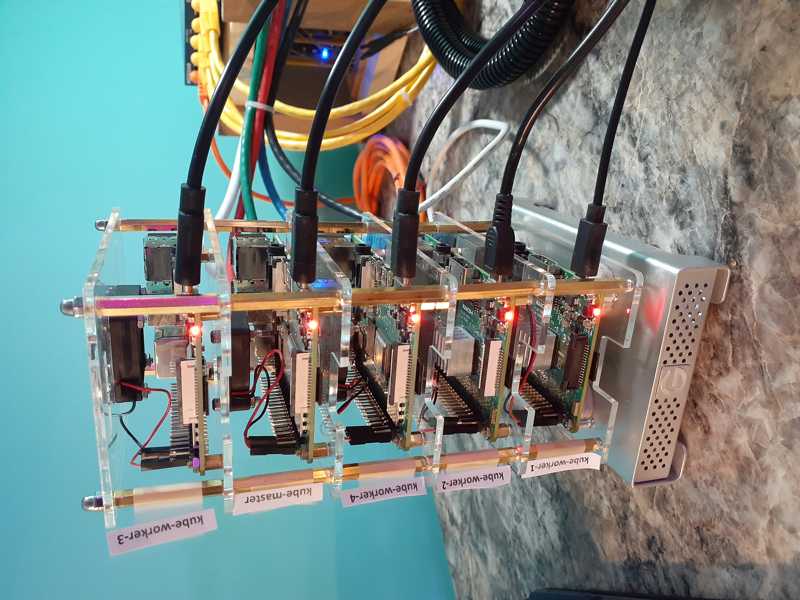

= Kubernetes Tower
FortyTwoBinary Team
:description: installation reference
:toc: left
:icons: font
:docinfo: shared
:numbered:
:source-highlighter: pygments
:stylesheet: italian-pop.css
:website: https://control-1.fortytwobinary.lab/
:author: David L. Whitehurst
:pi3: Raspberry Pi 3 Model B
:pi4: Raspberry Pi 4 Model B

{website}[Site Homepage]

{endpoint-url}/welcome.html[Lab Homepage]

image:images/vy.png["Company Logo",height=32]

Welcome to the FortyTwoBinary service documentation for our Kubernetes Tower, "Frankie" or
or short for Frankenstein. The tower consists of two {pi3} machines and 3 {pi4} machines atop
a G-Technology 500GB <<X1002,NAS>>. This document is subject to great change and will be maintained in a software repository https://github.com/fortytwobinary/labdocs[here].

[WARNING]
This {description} was drafted and is maintained as a DevOps reference to the work that occurs on the FortyTwoBinary network and infrastructure. The
powerful command-line instructions found here, may or may not be accurate
or timely. This warning is given to let the DevOp be aware that commands
may not be idempotent and before root-level (sudo) actions are taken, to
think twice before hitting the Enter key.

.This document
**********************************************************************
This document was written using asciidoc markup and the HTML you see is
generated by a tool driven using Python called asciidoctor. This
{description} is a powerful document that can be of great value in the event of data loss, machine crashes, backups, maintenance, installations, and troubleshooting.
**********************************************************************

== Introduction
This document will describe the creation of Frankie, my new Raspberry Pi
Kubernetes tower.

The tower began with 2 {pi3} machines I had for mining alt-coins or CPU-mined
cryptocurrency. The 3 {pi4} machines were recently purchased from Labist. They
came with heavy metal heatsinks and fans, but the tower kit I later purchased
came with tiny quiet fans for each Pi.

The G-Technology drive beneath the tower was an external backup disk for my
Apple macbook pro at the time prior to 2008. It's 500GB and hosts an ext4
filesystem now for the 5 machines to share as an <<X1003,NFS>> mount.

.Disclaimer
**********************************************************************
Kubernetes has emerged as powerful way to serve web content and move
data over the internet at grand scale. This is very expensive even for
well-paid consultants to learn on their own. Small computers and virtual
machines are inexpensive and convenient to own. My mission here is to
describe the creation of my machine tower and Kubernetes cluster.

The instructions described here worked for me however, each step was
not without issue because my steps were taken from various online tutorials
and personal blog postings. Also, I would recommend a written plan before
any machine configuration. Be sure to perform any step on all machines if
you decide not to finish the project in one session. My software versions
for Kubernetes are locked, but they also differ by patch versions.
**********************************************************************

== Preliminaries

=== Goal
The goal here is to install and maintain a Kubernetes (K8s) cluster on a
tower consisting of a control-plane (master) and 4 worker nodes.

=== Platform
As stated in the Goal section above, the platform for installation and
hosting consists of 5 newer Raspberry Pi machines with Ubuntu 20.04 LTS aarm64
images (operating system).

=== Dependencies
Dependencies can be machines, wires, hardware, software packages, configurations
or even tools that need to be available during the process of installation.
In this case, the hardware was our foundation. This process requires 5 Raspberry
Pi machines, power, and ethernet cabling to a local network. We also required 5 -
16GB microSD cards for flashing the operating system.

Download Ubuntu 20.04 LTS for aarm64 architecture at the following link: https://ubuntu.com/download/raspberry-pi[https://ubuntu.com/download/raspberry-pi]. Please note that you must select the 64bit choice here.

Also, download Balena Etcher for your workstation. https://www.balena.io/etcher/[https://www.balena.io/etcher/]. This application will be used to
flash or write the boot images (Ubuntu) to your 5 new microSD cards.

== Installation
The creation of a Kubernetes cluster required the installation of a lighter, Linux server operating system. The new machines came with Raspbian desktop,
a Debian-based distribution for ARM64 processors. We could have stripped or
uninstalled the desktop but I found an online setup for Kubernetes on Raspberry
Pi by a guy that works for RedHat here in Raleigh NC. He recommended Ubuntu
20.04 LTS. First, let's flash 5 microSD cards with the downloaded Ubuntu image.

=== Operating System
Place a new or recently erased microSD card in your workstation (working machine).
Open BalenaEtcher (was Etcher) and click "Flash from file". Select the Ubuntu image in your folder containing the image downloaded earlier.

Click select target and choose the 16GB storage media, then click Flash. Go get a glass of tea. When the flash is complete, repeat the process for the remaining 4
microSD cards. When they are complete, install each card in the machines.

=== Update and Upgrade
Let's start our machines, update the OS, name our hosts, and shutdown. I'm going
to describe this process for one machine. You can do these simultaneously or using
Putty with multiple sessions if you prefer.

==== Initial Logon
When you start the new OS, sshd is built in and either you already know the IP or
you'll need to use your router to determine the local IP. For most people, the IP
is probably assigned (dynamic host control protocol (DHCP)) by your router. Please
note that if you start all of the machines at the same time and you don't already
have fixed or static (known) IPs, you will not be able to identify machines. Each
OS is assigned a hostname "ubuntu" and unless you know the IPs ahead of time, you
will see a list of attached devices on your router, all called "ubuntu".

When the machine comes online, it's hostname is "ubuntu" and a sudo user "ubuntu"
has already been created. Connect to the machine using ssh like so:

[source,bash]
----
$  ssh ubuntu@192.168.1.17
----
Enter "ubuntu" as the password. The system will immediately prompt for a new
password. When the new password is accepted, the ssh session is terminated by the
system. I'm not sure why, but I assume it's a security thing.

==== Package Updates
Log back into the machine and we'll now update and upgrade the OS.

[source,bash]
----
$ sudo apt-get update && sudo apt-get upgrade
----
Go get another glass of tea. When the upgrade is complete, we'll change the
hostname and shutdown.

==== Hostnames
The new tower consists of a Kubernetes master and 4 workers. We'll name master,
"kube-master" and each worker `kube-worker-n` e.g. `kube-worker-3`. Open an ssh
with the machine you will call `kube-master`.

[source,bash]
----
$ sudo vi /etc/hostname
----
There should be one line with `ubuntu` so replace it with the new hostname. In
the past we had to change `/etc/hosts` too this distribution of Linux does not
require editing `/etc/hosts`. Change each hostname (all machines) and then reboot.

[source,bash]
----
$ sudo shutdown -r now
----
When each machine comes back, it's hostname will have changed. Update your Putty
sessions if you are using saved sessions.

.Note
*****
My machines already had static IPs that were reserved when they first came online.
These MAC addresses are known to the router and this made identification of the
machines easy. Also, I could do this work with all machines running on the new OS.
I don't think static local IPs are required for your eth0 interfaces since the
nodes all have unique hostnames however, I have 2  <<X999,DNS>> servers on the network and
these machines are managed as "trusted servers" with forward and reverse lookup
entries.
*****

=== Provisioning
Now we are ready to configure and provision the machines with Kubernetes. During
the process of installing Kubernetes, we'll also bring each of the cluster nodes
into operation. Starting with 5 quiet machines, let's start kube-master, or our
control-plane and set that one up first. The host kube-master will act as a
control-plane and delegate to the 4 worker nodes.

==== All Nodes
Before we can install Kubernetes, we need to make a few changes to our machines.
We will install the Docker (container platform), change the https://www.kernel.org/doc/Documentation/cgroup-v1/cgroups.txt[cgroups] driver, and optimize our systems for kernel, memory, and swap features.

Let's install Docker.
[source,bash]
----
$ sudo apt install -y docker.io
----
Once the installation is complete, run ...
[source,bash]
----
$ sudo docker info
----
Notice that the cgroups driver is cgroups and the warnings at the end of the output.
[source,bash]
----
...
WARNING: No memory limit support
WARNING: No swap limit support
WARNING: No kernel memory limit support
WARNING: No kernel memory TCP limit support
WARNING: No oom kill disable support
----
This shows us that Docker has no memory, swap, or kernel support. We can fix this
by changing the cgroups driver to `systemd`. Systemd is recommended by Kubernetes
and to ensure better system stability. Let's tell our system with specification
that cgroups management will now be `systemd`.

Create or edit this file and contents:
[source,bash]
----
$ sudo cat > /etc/docker/daemon.json <<EOF
{
  "exec-opts": ["native.cgroupdriver=systemd"],
  "log-driver": "json-file",
  "log-opts": {
    "max-size": "100m"
  },
  "storage-driver": "overlay2"
}
EOF
----
Now, let's influence the kernel, on boot, to use cgroups to limit memory and swap.
We will append these options to the end of `cmdline.txt`. Since we want to add
specific text to the end of the file, we'll use `sed` to do this.
[source,bash]
----
# Append the cgroups and swap options to the kernel command line
# Note the space before "cgroup_enable=cpuset" and to add a space after the last existing item on the line
$ sudo sed -i '$ s/$/ cgroup_enable=cpuset cgroup_enable=memory cgroup_memory=1 swapaccount=1/' /boot/firmware/cmdline.txt
----
Reboot the machine and run the `sudo docker info` again. You will see the cgroups
driver is now `systemd` and the limit warnings are gone.

Kubernetes also recommends that iptables and iptables6 be set to see bridged-network traffic.
[source,bash]
----
$ cat <<EOF | sudo tee /etc/sysctl.d/k8s.conf
net.bridge.bridge-nf-call-ip6tables = 1
net.bridge.bridge-nf-call-iptables = 1
EOF
----
Activate this configuration with ...
[source,bash]
----
sudo sysctl --system
----
Now we need to set up the Kubernetes apt repository and then install the Kubernetes packages. Let's first add the Google key and then add the Kubernetes
repo to our local list of repositories.
[source,bash]
----
# Add the packages.cloud.google.com apt key
$ curl -s https://packages.cloud.google.com/apt/doc/apt-key.gpg | sudo apt-key add -

# Add the Kubernetes repo to our list of repositories
$ cat <<EOF | sudo tee /etc/apt/sources.list.d/kubernetes.list
deb https://apt.kubernetes.io/ kubernetes-xenial main
EOF
----

Now, we can install the Kubernetes packages to each of our cluster nodes.
[source,bash]
----
$ sudo apt update && sudo apt install -y kubelet kubeadm kubectl
----
We now need to disable any updates from the Kubernetes repo so our installs remain
consistent. And, we should handle version updates manually after our cluster is
in place.
[source,bash]
----
$ sudo apt-mark hold kubelet kubeadm kubectl
----
Kubernetes is installed!

==== kube-master
Now that's Kubernetes has been installed on all machines, it's time to set up and
configure our kube-master host and begin the creation of our Kubernetes cluster.

The first thing we are going to do is create a token for the cluster nodes to use
when joining the cluster. We'll use kube-master to create a token and then use this token when we initialize the control-plane.
[source,bash]
----
$ TOKEN=$(sudo kubeadm token generate)
----
Run the following to determine the Kubernetes version.
[source,bash]
----
$ kubeadm version
kubeadm version: &version.Info{Major:"1", Minor:"20", GitVersion:"v1.20.4", GitCommit:"e87da0bd6e03ec3fea7933c4b5263d151aafd07c", GitTreeState:"clean", BuildDate:"2021-02-18T16:09:38Z", GoVersion:"go1.15.8", Compiler:"gc", Platform:"linux/arm64"}
----
My version was 1.20.4 so I add that in the initialization command. Now use this token to initialize the control-plane server (kube-master).
[source,bash]
----
$ sudo kubeadm init --token=${TOKEN} --kubernetes-version=v1.20.5 --pod-network-cidr=10.244.0.0/16
----
The CIDR was chosen as an example from other blog postings. More research is needed to understand the CIDR choice. I have no conflicting 10.x.x.x networks on
our home network.

The initialization should be successful and the following output should be seen
and you should copy this off for safekeeping.
[source,bash]
----
Your Kubernetes control-plane has initialized successfully!

To start using your cluster, you need to run the following as a regular user:

  mkdir -p $HOME/.kube
  sudo cp -i /etc/kubernetes/admin.conf $HOME/.kube/config
  sudo chown $(id -u):$(id -g) $HOME/.kube/config

Alternatively, if you are the root user, you can run:

  export KUBECONFIG=/etc/kubernetes/admin.conf

You should now deploy a pod network to the cluster.
Run "kubectl apply -f [podnetwork].yaml" with one of the options listed at:
  https://kubernetes.io/docs/concepts/cluster-administration/addons/

Then you can join any number of worker nodes by running the following on each as root:

sudo kubeadm join 192.168.1.12:6443 --ignore-preflight-errors=all --token lm8kpx.fs5six37dossytv6 \
    --discovery-token-ca-cert-hash sha256:5d43f3aa2fedfb5e6e4a895a8c160d3a917b1b4776d9cde4001477a53fa88008
----
Your control-plane is now running successfully.

Make a note of two things. 1) The Kubernetes kubectl connection information has been written to /etc/kubernetes/admin.conf. 2) This kubernetes configuration file can be copied to ~/.kube/config, either for root or a normal user on the master node or to a remote machine. This will allow you to control the cluster with the kubectl command.

Use the `kubectl` utility now to verify that the master node is running.
[source,bash]
----
$ kubectl get nodes
----
You should see the master node is up and running.

Before we join our worker nodes, we need to install a Container Network Interface (CNI) add-on
called Flannel. This add-on provides networking management for our fixed and chosen CIDR. The
Flannel add-on is easily installed via command-line using a YAML manifest. Apply the following
manifest in a file called `kube-flannel.yaml` like so. The file below is for Kubernetes v1.17+ and our install was 1.20.4.
[source,yaml]
----
curl -sSL https://raw.githubusercontent.com/coreos/flannel/master/Documentation/kube-flannel.yml | kubectl apply -f -
----
Now our worker joins should go without issue. See <<Retrospective and Notes>> below.

==== kube-worker-n
Each worker should now only need to join the cluster. The software and configuration was done
prior to some specifics only for kube-master. Let's send a join command from a worker to master
and ask to join.
[source,bash]
----
$ sudo kubeadm join 192.168.1.12:6443 --token lm8kpx.fs5six37dossytv6 \
    --discovery-token-ca-cert-hash sha256:5d43f3aa2fedfb5e6e4a895a8c160d3a917b1b4776d9cde4001477a53fa88008
----
Repeat for each worker and then verify that everything is good.
[source,bash]
----
$ kubectl get nodes -o wide
----
.Note
*****
This did not originally work for me. There was some confusion around the installation of
Flannel and how it was obtained. I have modified the installation of Flannel above to suit
what I think is correct however, I will do this again in a more automated fashion and I will
discuss my issues with all this in the Retrospective section below.
*****

=== Testing and Health
In a future edit of this document, I'll add a really simple deployment to show that our cluster
is in fact running and viable. For now, I'll leave a couple commands I've learned to show the
health and information about our new cluster.

[source,bash]
----
$ kubectl cluster-info
Kubernetes control plane is running at https://192.168.1.12:6443
KubeDNS is running at https://192.168.1.12:6443/api/v1/namespaces/kube-system/services/kube-dns:dns/proxy

To further debug and diagnose cluster problems, use 'kubectl cluster-info dump'.
----
The next command shows critical components. Notice that Flannel and proxy ones are replicated
for each node.
[source,bash]
----
ubuntu@kube-master:~$ ^C
ubuntu@kube-master:~$ kubectl get pod -n kube-system
NAME                                  READY   STATUS    RESTARTS   AGE
coredns-74ff55c5b-9nn7l               1/1     Running   0          42h
coredns-74ff55c5b-fcnl2               1/1     Running   0          42h
etcd-kube-master                      1/1     Running   0          42h
kube-apiserver-kube-master            1/1     Running   0          42h
kube-controller-manager-kube-master   1/1     Running   5          42h
kube-flannel-ds-hvlbh                 1/1     Running   4          38h
kube-flannel-ds-ltgpv                 1/1     Running   0          38h
kube-flannel-ds-xdzss                 1/1     Running   0          38h
kube-flannel-ds-zqgbf                 1/1     Running   0          38h
kube-flannel-ds-zvssl                 1/1     Running   4          38h
kube-proxy-8fzx5                      1/1     Running   0          39h
kube-proxy-czrpw                      1/1     Running   4          38h
kube-proxy-qm7kf                      1/1     Running   4          38h
kube-proxy-sz5xz                      1/1     Running   0          39h
kube-proxy-zxnnc                      1/1     Running   0          42h
kube-scheduler-kube-master            1/1     Running   4          42h
ubuntu@kube-master:~$
----
And, our get nodes again in short format.
[source,bash]
----
ubuntu@kube-master:~$ kubectl get nodes
NAME            STATUS   ROLES                  AGE   VERSION
kube-master     Ready    control-plane,master   42h   v1.20.4
kube-worker-1   Ready    <none>                 39h   v1.20.5
kube-worker-2   Ready    <none>                 39h   v1.20.4
kube-worker-3   Ready    <none>                 39h   v1.20.5
kube-worker-4   Ready    <none>                 38h   v1.20.5
ubuntu@kube-master:~$
----

== Retrospective and Notes
The full administration and use of Vault is yet to be discovered. For now
we'll provide some cheatsheet commands and a few use cases.

=== Overall Process
Later ... you are welcome lol ...

[source,bash]
----
$ vault status
----

==== Preparation
Later ...

==== Planning
Later ...

=== Education
Later ...

=== Automation
Later ...

:numbered!:

== Acronyms
[horizontal]
[[X999]]DNS:: Domain Naming System
[[X1000]]IP:: Internet Protocol
[[X1003]]NFS:: Network File System
[[X1002]]NAS:: Network Attached Storage
NAT:: Network Address Translation
[[X1001]]SBC:: Small board computer
WAP::
Wireless Access Point

[glossary]
== Glossary
[glossary]
[[X8]] Block element::
An AsciiDoc block element is a document entity composed of one or
more whole lines of text.

[[X34]] Inline element::
AsciiDoc inline elements occur within block element textual
content, they perform formatting and substitution tasks.

Formal element::
An AsciiDoc block element that has a BlockTitle. Formal elements
are normally listed in front or back matter, for example lists of
tables, examples and figures.

Verbatim element::
The word verbatim indicates that white space and line breaks in
the source document are to be preserved in the output document.

[appendix]
== License
This document is licensed by the Apache License version 2.0. Currently,
the content in this document is being kept from the public however, in
the event the material contained here is willingly shared with
others, the license will remain unchanged and will convey with the
transference of the material.

Apache License
Version 2.0, January 2004
http://www.apache.org/licenses/

A copy has also been provided with this software repository.

Copyright (C) 2021 David L Whitehurst.
