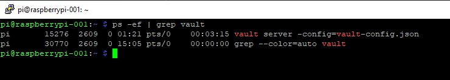
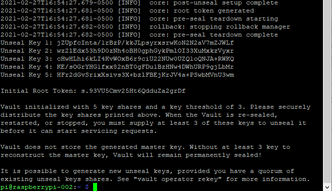

Hashicorp Vault
===============
FortyTwoBinary Team
:description: installation reference
:toc: left
:icons: font
:docinfo: shared
:numbered:
:source-highlighter: coderay
:stylesheet: italian-pop.css
:website: https://fortytwobinary.com/
:author: David L. Whitehurst
:machine-os: Raspberry Pi 4 Model B

{website}[Site Homepage]

{endpoint-url}/welcome.html[Lab Homepage]

Welcome to the FortyTwoBinary service documentation for Hashicorp Vault
on {machine-os}. This document is subject to great change and will be maintained in a software repository https://github.com/fortytwobinary/labdocs[here].

[WARNING]
This {description} was drafted and is maintained as a DevOps reference to the work that occurs on the FortyTwoBinary network and infrastructure. The
powerful command-line instructions found here, may or may not be accurate
or timely. This warning is given to let the DevOp be aware that commands
may not be idempotent and before root-level (sudo) actions are taken, to
think twice before hitting the Enter key.

.This document
**********************************************************************
This document was written using asciidoc markup and the HTML you see is
generated by a tool driven using Python called asciidoctor. This
{description} is a powerful document that can be of great value in the event of data loss, machine crashes, backups, maintenance, installations, and troubleshooting.
**********************************************************************

Introduction
------------
The network and infrastructure playbook is a compilation of the notes,
configurations, how-tos, general, and technical documentation that will
follow the evolution of the FortyTwoBinary network. This treatise will
outline and describe the network, the configurations, the machines,
and the software the operates over it.

The FortyTwoBinary network is an internal network behind a home ISP or
Internet Service Provider and protected from the public internet via
a secure and highly configured network router.

FortyTwoBinary is a made up organization name for our home network and
used in the event that other people join me in my learning and education.

.My Mission
**********************************************************************
Kubernetes has emerged as powerful way to serve web content and move
data over the internet at grand scale. This is very expensive even for
well-paid consultants to learn on their own. Small computers and virtual
machines are inexpensive and convenient to own. My mission is to learn
more about containers, hosting, and clustering all on my own time and
do this economically of course.

Turing Pi is now making a cluster board for multiple Raspberry Pi boards
and the cluster capability for up to 28 cores or 7 Raspberry Pi computers.
Canonical Ubuntu is also producing a software product called MicroK8s or
what they call a no-more, no-less version of Kubernetes that will run on
a single server host. The FortyTwoBinary network (my home network) is
slowly becoming a laboratory for learning.
**********************************************************************

Preliminaries
-------------

Goal
~~~~
The goal here is to install and maintain a single instance of a running
Hashicorp Vault in production mode on a Raspberry Pi 4 Model B.

Platform
~~~~~~~~
As stated in the Goal section above, the platform for installation and
service is the Raspberry Pi 4 Model B. We recently procured 3 Labist
starter kits with the new Raspberry Pi 4 Model B machines. These boards
have 8GB of fixed RAM and Raspbian (Debian 10 Buster) OS for arm64 (arm7l)
came on a 128GB Sansdisk microSD card. Exceptionally easy startup and our
3 machines are now online, running, and accessible via static IPs.

Dependencies
~~~~~~~~~~~~
Dependencies can be software packages, configurations, or even tools that
need to be available during the process of installation. In this case,
everything was available. An ssh connection to the Raspberry Pi allowed
for a smooth installation of the Vault binary for this platform. VIM was
installed but VI was present at initial boot.

We want to note that the initial binary did not work correctly. We
also tried a Docker version prior to a strict server install. It seems
that a 64bit edition for the ARM processor is yet to be available. We will
periodically check for this and upgrade when available.

Installation
------------
Installation of the Hashicorp Vault consists of placement of the vault
binary (executable) in a quiet location on the machine that is available
on the administrator's `$PATH`. Currently, the binary is run as a background process and will ultimately be set up with a control script and probably called in `rc.local`.

TIP: Download the Vault binary for Raspberry Pi 4 Model B here: https://releases.hashicorp.com/vault/1.6.2/vault_1.6.2_linux_arm.zip[https://releases.hashicorp.com/vault/1.6.2/vault_1.6.2_linux_arm.zip]

[WARNING]
Do NOT download the ARM64 edition for Linux. It will NOT run on the Raspberry Pi 4 Model B using Raspbian (Debian 10 Buster) as of February 27, 2021. This message is HIGHLY subject to CHANGE.

Unzip the download somewhere and we moved the file `vault` to `<user-home>/bin` Then we added the following to our `.bashrc` and sourced it instead of logging out and back in.

[source,bash]
----
export PATH=/home/pi/bin:$PATH
----
Now our user (pi) can execute the vault program from anywhere. The only
caveat is that with the command, a configuration is needed. Let's create
the configuration for Vault in the user's home directory. We'll then run
the executable and discuss optimum configuration in the
section below.

Configuration
~~~~~~~~~~~~~
Hashicorp Vault can be configured using JSON or <<X900>>. We chose to use
JSON only for familiarity. Create a file called `vault-config.json` in the
user's home directory and add this content:

[source,json]
----
{
  "backend": {
    "file": {
      "path": "vault/data"
    }
  },
  "listener": {
    "tcp":{
      "address": "0.0.0.0:8200",
      "tls_disable": 1
    }
  },
  "ui": true
}
----
Take note that the path `vault/data` will be relative to where the vault
executable is run. We will issue the command from the user's home directory
and where this configuration file currently resides. Also the `0.0.0.0` in
the listener section is a placeholder that defines a non-routable IP address. It has been explained to mean "all addresses". Learn more here:
https://en.wikipedia.org/wiki/0.0.0.0[https://en.wikipedia.org/wiki/0.0.0.0]. The 8200 port is the Hashicorp Vault default.

[WARNING]
Please note that HTTPS is not being used. This is NOT good practice however, final software configuration may occur within the FortyTwoBinary
network (internal) or in the event all configuration is moved onto the
public Internet.

Startup
~~~~~~~
Run the following command from your user's home directory:

[source,bash]
----
$  vault server -config=vault-config.json &
----
You may need to hit enter after the server output on the screen. Obtain
the prompt by hitting the return key once. Then let's do a process
status and look for the running vault.

[source,bash]
----
$ ps -ef | grep vault
----
You should see something like this:

We'll leave the `kill -9` business to you sys-Admin types and for later.

Initial Opening
~~~~~~~~~~~~~~~
Before the Hashicorp Vault can be opened, you must initialize Vault.
Every initialized vault starts in the sealed state. We'll first initialize
the vault and then unseal it step by step.

[source,bash]
----
$ vault operator init
----
This will initialize the system and create a series of unseal keys and an
encrypted root token. You will use 3 of the 5 keys given (your choice) to
unseal the vault and then the root token to login. The operator init
command has options, but for now we're do things the easy way. Again, do
remember that this documentation is ALWAYS subject to change.

When vault is initialized you should see output similar to this:

[WARNING]
You must capture the unseal keys and the root initial token. If you lose
this information you might as well start over.

Unseal
~~~~~~
Now we will unseal the vault using the keys provided. You will now call
for Vault to unseal 3 times using the following command.

[source,bash]
----
$ vault operator unseal
----

Provide the keys one by one and you will see `vault status` output each
time. On the third time you will notice that the sealed attribute is false.
The unsealing operation was a success. Now login.

[source,bash]
----
$ vault login
----
This time you enter the root token. Remember not to lose the info from the
initialization. We generally do this:

[source,bash]
----
$ vault operator init > keeper
----

Administration
--------------
The full administration and use of Vault is yet to be discovered. For now
we'll provide some cheatsheet commands and a few use cases.

Common Commands
~~~~~~~~~~~~~~~
Later ... you are welcome lol ...

[source,bash]
----
$ vault status
----

Administrative
^^^^^^^^^^^^^^
Later ...

Use-Case
^^^^^^^^
Later ...

Scripted Process Control
~~~~~~~~~~~~~~~~~~~~~~~~
Later ...

Snapshot Backup
~~~~~~~~~~~~~~~
Later ...

:numbered!:

Acronyms
--------
[[X900]]HCL::
    Hashicorp Control Language. Read more here: https://github.com/hashicorp/hcl[https://github.com/hashicorp/hcl]
NAT::
    Network Address Translation
SBC::
    Small board computer
WAP::
    Wireless Access Point

[glossary]
Glossary
--------
[glossary]
[[X8]] Block element::
    An AsciiDoc block element is a document entity composed of one or
    more whole lines of text.

[[X34]] Inline element::
    AsciiDoc inline elements occur within block element textual
    content, they perform formatting and substitution tasks.

Formal element::
    An AsciiDoc block element that has a BlockTitle. Formal elements
    are normally listed in front or back matter, for example lists of
    tables, examples and figures.

Verbatim element::
    The word verbatim indicates that white space and line breaks in
    the source document are to be preserved in the output document.

[appendix]
License
-------
This document is licensed by the Apache License version 2.0. Currently,
the content in this document is being kept from the public however, in
the event the material contained here is willingly shared with
others, the license will remain unchanged and will convey with the
transference of the material.

Apache License
Version 2.0, January 2004
http://www.apache.org/licenses/

A copy has also been provided with this software repository.

Copyright (C) 2021 David L Whitehurst.
